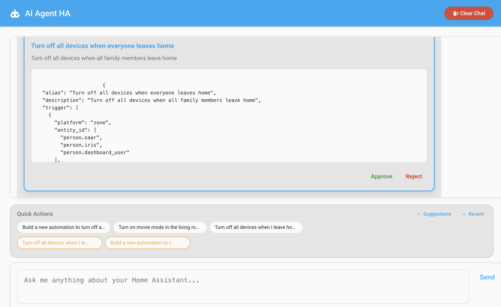

# AI Agent HA

A powerful Home Assistant custom integration that connects your Home Assistant instance with multiple AI providers (OpenAI, Google Gemini, Anthropic (Claude), OpenRouter, and Llama) to translate user requests into valid Home Assistant operations, including creating automations automatically!

## ✨ Features

- 🤖 **Multiple AI Provider Support**: OpenAI, Google Gemini, Anthropic (Claude), OpenRouter, and Llama
- 🎯 **Model Selection**: Choose from predefined models or use custom model names
- 🏠 **Smart Home Control**: Turn lights on/off, control climate, and manage devices
- ⚡ **Automation Creation**: Automatically create automations based on natural language
- 📊 **Data Access**: Get entity states, history, weather, and more
- 🔒 **Secure**: API keys stored securely in Home Assistant
- 🎨 **Beautiful UI**: Clean, modern chat interface
- 🔄 **Real-time**: Instant responses and updates

## 📸 Screenshots

### Automation Creation


## 🚀 Supported AI Providers

### OpenAI
- **Models**: GPT-3.5 Turbo, GPT-4, GPT-4 Turbo, GPT-4o, O1-Preview, O1-Mini
- **Setup**: Get API key from [OpenAI Platform](https://platform.openai.com/api-keys)

### Google Gemini
- **Models**: Gemini 1.5 Flash, Gemini 1.5 Pro, Gemini 1.0 Pro, Gemini 2.0 Flash Exp
- **Setup**: Get API key from [Google AI Studio](https://aistudio.google.com/app/apikey)

### Anthropic (Claude)
- **Models**: Claude 3.5 Sonnet, Claude 3.5 Haiku, Claude 3 Opus, Claude 3 Sonnet, Claude 3 Haiku
- **Setup**: Get API key from [Anthropic Console](https://docs.anthropic.com/en/docs/get-started)
- **Popular Models**:
  - `claude-3-5-sonnet-20241022` (Latest and most capable)
  - `claude-3-5-haiku-20241022` (Fast and efficient)
  - `claude-3-opus-20240229` (Most powerful for complex tasks)

### OpenRouter
- **Models**: Access to 100+ models including Claude, Llama, Mistral, and more
- **Setup**: Get API key from [OpenRouter](https://openrouter.ai/keys)
- **Popular Models**: 
  - `anthropic/claude-3.5-sonnet`
  - `meta-llama/llama-3.1-70b-instruct`
  - `mistralai/mixtral-8x7b-instruct`

### Llama
- **Models**: Llama 4 Maverick, Llama 3.1, Llama 3.2
- **Setup**: Get API key from your Llama provider

## 📦 Installation

### HACS Installation (Recommended)

1. Open HACS in your Home Assistant instance
2. Click on "Integrations"
3. Click the three dots in the top right corner
4. Select "Custom repositories"
5. Add this repository: `https://github.com/sbenodiz/ai_agent_ha`
6. Select "Integration" as the category
7. Click "Add"
8. Find "AI Agent HA" in the integration list
9. Click "Download"
10. Restart Home Assistant
11. Go to Settings → Devices & Services → Add Integration
12. Search for "AI Agent HA"
13. Follow the setup wizard to configure your preferred AI provider

### Manual Installation

1. Download the latest release from the [releases page](https://github.com/sbenodiz/ai_agent_ha/releases)
2. Extract the files
3. Copy the `custom_components/ai_agent_ha` folder to your Home Assistant `custom_components` directory
4. Restart Home Assistant
5. Go to Settings → Devices & Services → Add Integration
6. Search for "AI Agent HA"
7. Follow the setup wizard to configure your preferred AI provider

## ⚙️ Configuration

The integration uses a two-step configuration process:

### Step 1: Choose AI Provider
Select your preferred AI provider from the dropdown:
- OpenAI
- Google Gemini  
- Anthropic (Claude)
- OpenRouter
- Llama

### Step 2: Configure Provider
Enter your API credentials and optionally select a model:
- **API Key/Token**: Your provider-specific API key
- **Model**: Choose from predefined models or enter a custom model name

### Configuration Examples

```yaml
# Example configuration.yaml (optional - integration supports config flow only)
ai_agent_ha:
  ai_provider: anthropic
  anthropic_token: "sk-ant-..."
  models:
    anthropic: "claude-3-5-sonnet-20241022"
```

## 🎮 Usage

### Chat Interface
Access the beautiful chat interface at:
- **Sidebar**: AI Agent HA panel
- **URL**: `http://your-ha-instance:8123/ai_agent_ha`

### Voice Commands
Ask natural language questions like:
- "Turn on all the lights in the living room"
- "What's the temperature in the bedroom?" 
- "Create an automation to turn off lights at 11 PM"
- "Show me the weather forecast"
- "Which doors are open?"

### Service Calls
Use the `ai_agent_ha.query` service in automations:

```yaml
service: ai_agent_ha.query
data:
  prompt: "Turn on the porch light when motion is detected"
```

## 🔧 Advanced Features

### Custom Models
Enter any model name in the "Custom Model" field:
- OpenAI: `gpt-4-0125-preview`
- Anthropic: `claude-3-opus-20240229`
- OpenRouter: `anthropic/claude-3-opus`
- Gemini: `gemini-pro-vision`

### Automation Creation
The AI can create automations automatically:
1. Ask: "Create an automation to turn on lights at sunset"
2. Review the generated automation
3. Approve or reject the suggestion
4. Automation is added to your Home Assistant

### Data Access
The AI can access comprehensive Home Assistant data:
- Entity states and history
- Weather information
- Person locations
- Device registry
- Area/room information
- Statistics and analytics

## 🛠️ Development

### Contributing
1. Fork the repository
2. Create a feature branch
3. Make your changes
4. Test thoroughly
5. Submit a pull request

### API Structure
The integration provides these main components:
- **AI Clients**: Modular providers (OpenAI, Gemini, OpenRouter, Llama)
- **Agent**: Core logic for processing requests
- **Config Flow**: Setup and options management
- **Frontend**: Chat interface

## 📋 Requirements

- Home Assistant 2023.3+
- Python 3.11+
- One of the supported AI provider API keys

## 🔒 Security

- API keys are stored securely in Home Assistant's encrypted storage
- All communication uses HTTPS
- No data is stored outside your Home Assistant instance
- Provider-specific security practices are followed

## ☕ Support the Project

If you find this integration helpful and would like to support its development, you can buy me a coffee! Your support helps keep this project active and maintained.

[](https://www.buymeacoffee.com/sbenodiz)

Every contribution, no matter how small, is greatly appreciated and helps fund the continued development and improvement of AI Agent HA.

## 📝 License

This project is licensed under the MIT License - see the [LICENSE](LICENSE) file for details.

## 🆘 Support

- **Issues**: [GitHub Issues](https://github.com/sbenodiz/ai_agent_ha/issues)
- **Discussions**: [GitHub Discussions](https://github.com/sbenodiz/ai_agent_ha/discussions)
- **Documentation**: [Wiki](https://github.com/sbenodiz/ai_agent_ha/wiki)

## 🙏 Acknowledgments

- Home Assistant community for the excellent platform
- All AI providers for their powerful APIs
- Contributors and testers who help improve this integration

---

**Made with ❤️ for the Home Assistant community**
