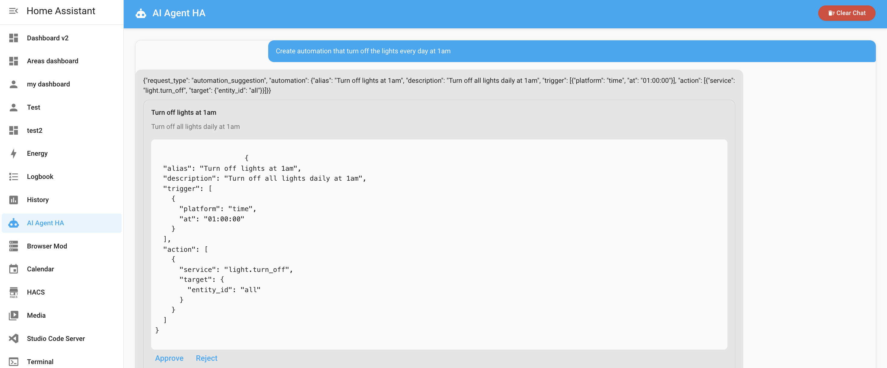

# AI Agent HA Custom Integration
> ⚠️ This is an early-stage, proof-of-concept version of the integration. Features and stability may change as development progresses. Use with caution and provide feedback!

A Home Assistant custom component that provides an AI-powered agent capable of generating automations based on natural language queries. The agent connects to all entities in your Home Assistant instance and uses OpenAI's or Llama API to translate user requests into valid Home operations including creating automations for you!

---

## Features

* **Natural Language Automation**: Ask the agent to create automations in plain English.
* **Entity-Aware**: Automatically discovers and uses your existing Home Assistant entities.
* **UI Integration**: Manage and approve suggested automations directly from Home Assistant's UI (see screenshot below).



---

## Installation

### Via HACS (Recommended)

1. Install HACS if you haven't already.
2. Open HACS in Home Assistant and navigate to **Integrations**.
3. Click **Explore & Add Repositories** and search for **AI Agent HA**.
4. Click on the repository, then click **Download**.
5. Restart Home Assistant.
6. In the Home Assistant UI, go to **Settings → Devices & Services → Integrations**.
7. Click **Add Integration** and search for **AI Agent HA**.
8. Follow the prompts to configure your Llama or OpenAI API key.

### Manual Installation

1. Clone or download this repository:
   ```bash
git clone https://github.com/sbenodiz/ai_agent_ha.git
2. Copy the ai_agent_ha folder into your Home Assistant custom_components directory
4. Restart Home Assistant.
5. In the Home Assistant UI, go to **Settings → Devices & Services → Integrations**.
6. Click **Add Integration** and search for **AI Agent HA**.
7. Follow the prompts to configure your Llama or OpenAI API key.


---

## Configuration

The integration will automatically register a new panel in the sidebar named **AI Agent HA**. No YAML configuration is required. 
---

## Usage

1. Navigate to the **AI Agent HA** panel.
2. Type a natural language request, for example:

   > *"Create an automation to turn off all lights every day at 1am"*
3. Review the generated automation suggestion.
4. Click **Approve** to add it to your configuration, or **Reject** to discard.

The component will create the automation under `.storage/ai_agent_ha_automations` and reload automations automatically.


---

## Contributing

Contributions are welcome! Please open issues or pull requests on [GitHub](https://github.com/sbenodiz/ai_agent_ha).


---

## License

MIT License. See [LICENSE](./LICENSE) for details.

## Support
You can support this project by starring this GitHub repository. If you want, you can also buy me a coffee here:  
<br>
<a href="https://www.buymeacoffee.com/sbenodiz"></a>
