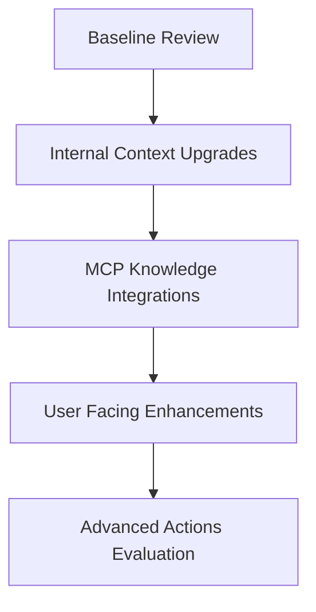

# GLM Agent HA Capability & MCP Expansion Research

## 1. Current Home Assistant-Centric Capabilities

- Core orchestration lives in [`agent.py`](custom_components/glm_agent_ha/agent.py:1), which currently supports:
  - Entity state reads (`get_entity_state`, `get_entities_by_domain`, `get_entities_by_area`, `get_entities`) and registry access (`get_entity_registry`, `get_device_registry`, `get_area_registry`).
  - Historical context via recorder (`get_history`, `get_statistics`) and logbook ingestion (`get_logbook_entries`).
  - Automation, dashboard, and service execution workflows (`create_automation`, `create_dashboard`, `update_dashboard`, `call_service`) aligned with service schemas in [`services.yaml`](custom_components/glm_agent_ha/services.yaml:1).
  - Weather snapshotting taken from first-available `weather.*` entity (no user override required).

- Configuration footprint (`manifest.json`, [`config_flow.py`](custom_components/glm_agent_ha/config_flow.py:1)) only advertises the GLM Coding Plan (OpenAI-compatible) provider; no dynamic provider registry or MCP connectors exist yet.

- Existing tests in [`tests/test_ai_agent_ha`](tests/test_ai_agent_ha/test_agent.py:1) validate OpenAI client wiring and baseline agent flow but do not cover MCP interactions or advanced data shaping.

## 2. Identified Capability Gaps

| Gap | Impact | Suggested Direction |
| --- | --- | --- |
| Missing first-class helpers for floor/area topology (e.g. floor→area→entity mapping) | Repeated multi-call loops, brittle prompt instructions | Add caching utilities that pre-compute `area_registry` → `entity_registry` joins |
| Limited diagnostics for device health (battery, last_seen, error codes) | AI responses cannot recommend maintenance tasks | Introduce device summary API leveraging `device_registry` metadata and diagnostic sensors |
| No energy, occupancy, or routine analytics | Hard to deliver proactive automations/dashboard tweaks | Build aggregators that wrap energy stats, person tracking, schedule heuristics |
| Dashboard and automation generation lacks linting/diff feedback | Users must trust AI blindly | Add validation hooks and state diff previews before applying changes |
| No external knowledge grounding | Higher risk of hallucinated services/entities | Integrate MCP-powered documentation and third-party data lookups |

## 3. MCP Tool Opportunities

| MCP Tool Idea | Purpose | Benefit | Considerations |
| --- | --- | --- | --- |
| **Context7 HA Docs** (`/upstash/context7`) | Fetch up-to-date Home Assistant REST/WebSocket references, service schemas, blueprints | Reduces hallucinations, keeps AI aligned with current HA versions | Requires request throttling; responses should be cached to avoid rate limits |
| **Context7 LangGraph Examples** (`/shak-shat/langgraph4context7`) | Reference agent orchestration patterns, prompt engineering snippets | Accelerates complex workflow design (e.g. multi-step automations) | Filter for relevant content to prevent overload |
| **Tavily Web Search** | Query vendor-specific device manuals, troubleshooting guides | Enables richer responses for device setup/repair questions | Must sanitize external data; set domain allowlists |
| **Local MCP “HA Insight” Server** | Expose derived metrics: area→entity graphs, energy usage, routine anomalies | Gives AI richer structured context without repeated HA API calls | Needs incremental refresh logic and storage hygiene |
| **Weather/Traffic MCP Adapters** | Pull granular forecast or commuting data | Supports proactive climate or routine automations | Ensure API keys and quotas are managed securely |

## 4. Third-Party Data & Web Research Targets

- **Vendor Knowledge Bases**: Philips Hue, IKEA Tradfri, Shelly, Aqara; use Tavily/Web fetch to retrieve FAQ snippets when devices fail.
- **Energy Providers**: Regional tariff APIs or CSV exports to cross-check consumption suggestions.
- **Occupancy/Calendar Sources**: Public holiday calendars, Google/Outlook scheduling (read-only scopes) for smarter routine handling.
- **Safety/Regulatory Feeds**: Weather alerts, security advisories (NOAA, European Meteo) for automation triggers.

## 5. Proposed Roadmap

1. **Internal Context Upgrades**
   - Build cached area/floor/entity indexes.
   - Add device diagnostics and energy summaries accessible through new agent helpers.
   - Expand automated tests to cover new helper outputs.

2. **MCP Knowledge Integrations**
   - Wire Context7 documentation queries with memoization.
   - Add Tavily-based web search MCP with domain filters and configurable rate limits.
   - Document data provenance and failure handling in [`DEVELOPMENT.md`](docs/DEVELOPMENT.md:1).

3. **User-Facing Enhancements**
   - Surface automation/dashboard linting (preflight warnings, diff previews).
   - Offer proactive suggestions (e.g. “battery low” tasks) driven by derived metrics.
   - Provide citation metadata for responses using external knowledge sources.

4. **Advanced Actions Evaluation**
   - Explore calendar/ticket MCPs for scheduling or support hand-off.
   - Add justification audit logs to satisfy security reviews.
   - Revisit UX, ensuring opt-in controls for proactive or external data usage.

## 6. Next Steps for Implementation

1. Finalize design docs for new helper APIs and MCP connectors.
2. Prototype local MCP server exposing enriched HA context; validate with integration tests.
3. Experiment with Context7/Tavily connectors in a sandbox, capturing rate-limit and latency metrics.
4. Update configuration/UI to let users enable/disable MCP sources explicitly.
5. Plan roll-out with staged feature flags and documentation updates.
